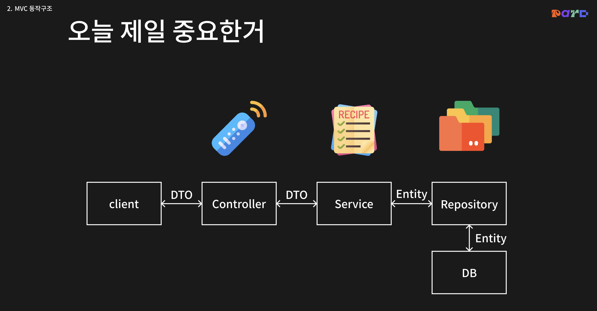
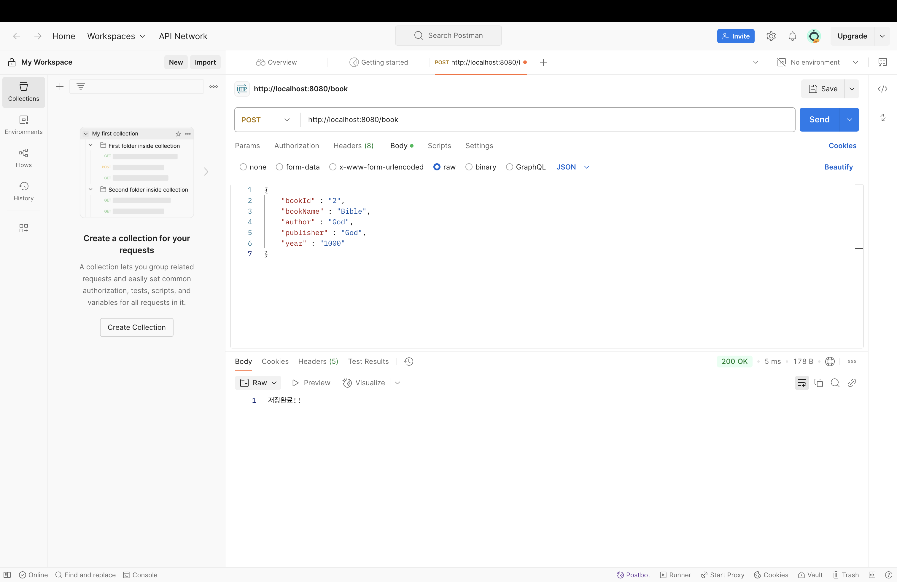
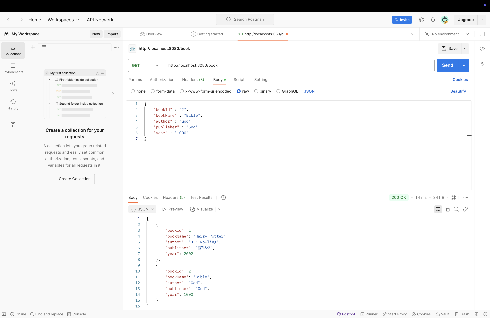
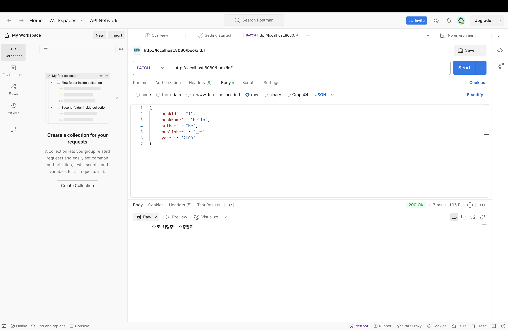
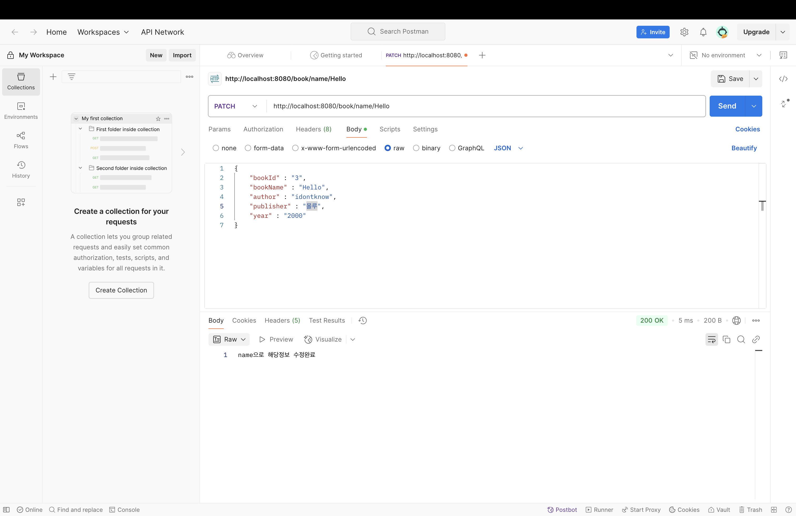
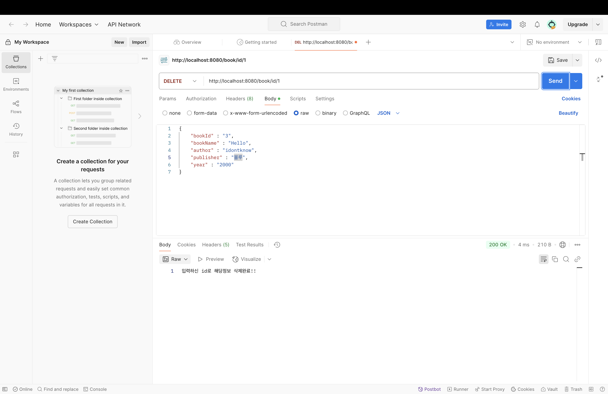
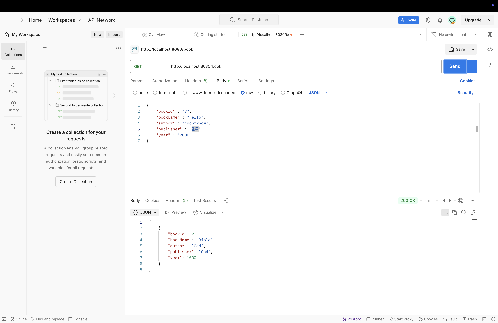

# 도서관 CRUD 구현

# 제일 중요한거는 밑의 사진의 흐름을 이해하는 것!

# 간단한 설명
이 코드는 책에 관한 것들을 도서관 db에 저장을 하고 저장한 자료들을 찾기 위해서 bookId와 bookName으로 책을 찾고 수정하고 삭제하는 코드임

# 예시 그림
1. 책 저장

2. 저장된 책 확인

3. BookId로 수정하기

4. 수정된 모습 확인

5. BookName으로 수정하기

6. 수정된 모습 확인

7. BookId로 삭제하기

8. 삭제된 모습 확인하기

# Id와 Name으로 확인,수정,삭제 다 가능함

