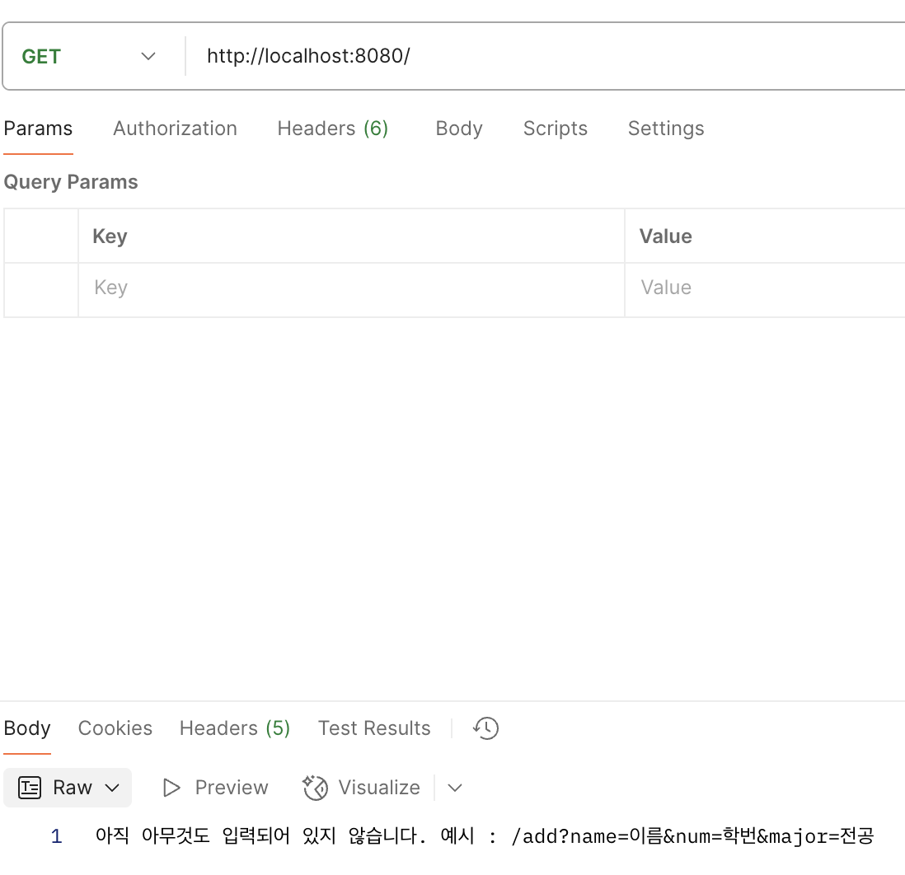
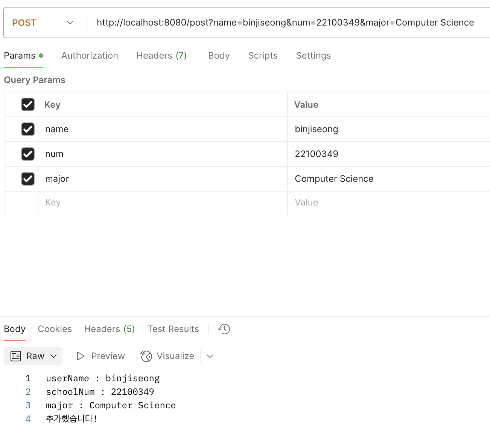
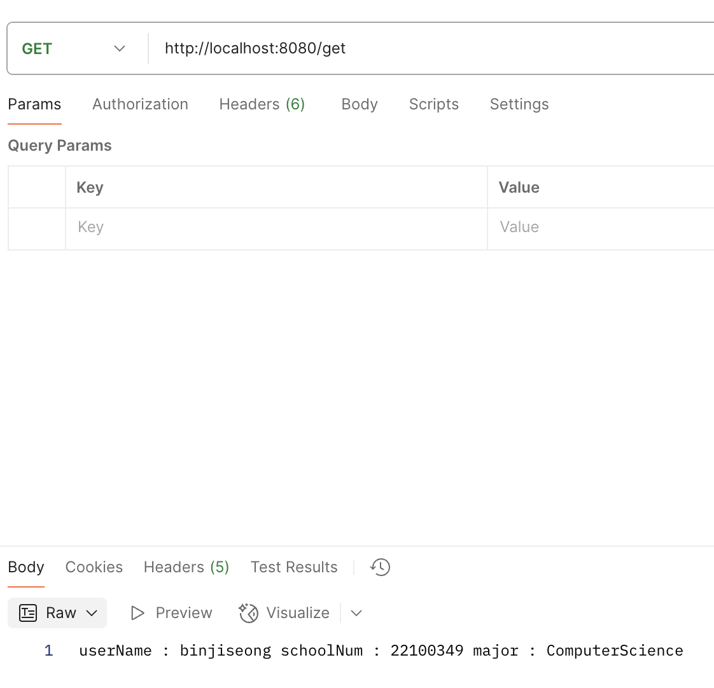
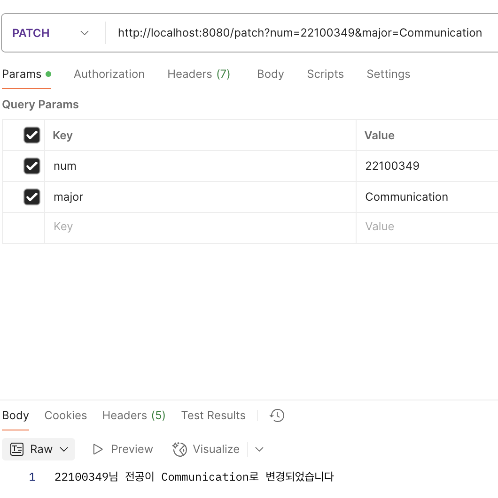
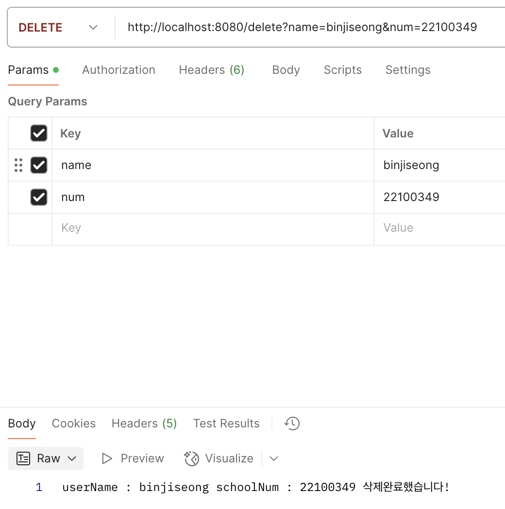

# 나만의 컨트롤러를 사용해서 웹페이지 만들기
 
1. 컨트롤러 `@Controller` `@RestController`
2. 맵핑 `@RequestMapping`, `@GetMapping`, `@PostMapping`, `@PatchMapping`,`@DeleteMapping`
 1번과 2번을 사용하여 나만의 웹페이지를 만들어봄

## 프로젝트 구조

- `Ji1Controller` 컨트롤러: Bin.html의 내용을 보여줌(사진+글)
- `Ji2Controller` 컨트롤러: get,post,path,delete 맵핑을 사용하는 모습을 보여줌

## Ji2Controller 코드 설명

### 1. **`@GetMapping("")`**

- **URL**: `/`
- **HTTP Method**: Get
- **설명**: 클라이언트가 `Get` 요청을 보내면 아무것도 입력되어 있지 않아 입력하라는 메세지를 띄움
- **예시**:
    - `/` → `아직 아무것도 입력되어 있지 않습니다. 예시 : /add?name=이름&num=학번&major=전공`

---

### 2. **`@PostMapping("/post")`**

- **URL**: `/post?name={name}&num={num}&major={major}`
- **HTTP Method**: POST
- **설명**: 클라이언트가 데이터를 `POST`로 전송하면, 데이터를 저장함.
- **예시**:
    - 클라이언트가 `binjiseong,22100349,Computer Science"` 형태의 데이터를 전송하면,
        - `/post?name=binjiseong&num=22100349&major=Computer Science` → `userName : binjiseong schoolNum : 22100349 major : Computer Science 추가했습니다!`

---

### 3. **`@GetMapping("/get")`**

- **URL**: `/get`
- **HTTP Method**: Get
- **설명**: 클라이언트가 `Get`을 전송하면, 저장된 데이터를 가져옴.
- **예시**:
    - `/get` → `userName : binjiseong schoolNum : 22100349" major : Computer Science`

---

### 4. **`@PatchMapping("/patch")`**

- **URL**: `/patch?num={num}&major={major}`
- **HTTP Method**: PATCH
- **설명**: 클라이언트가 `PATCH` 요청을 보내면, URL에 포함된 `num`과 `major`값을 받아서, num의 major를 변경함.
- **예시**:
    - `/patch?num=22100349&major=Communication` → `22100349님 전공이 Communication으로 변경되었습니다`

---
### 4. **`@DeleteMapping("/delete")`**

- **URL**: `/delete?name={name}&num={num}`
- **HTTP Method**: PATCH
- **설명**: 클라이언트가 `Delete` 요청을 보내면, URL에 포함된 `name`과 `num`값을 받아서, 저장된 값과 비교한 후 동일한 것이 있으면 삭제함.
- **예시**:
    - `/delete?name=binjiseong&num=22100349` → `userName : binjiseong schoolNum : 22100349 삭제완료했습니다!`

---

## 사용된 주요 어노테이션

- **@GetMapping**: GET 요청을 처리하는 메서드
- **@PostMapping**: POST 요청을 처리하는 메서드
- **@PatchMapping**: PATCH 요청을 처리하는 메서드
- **@RequestBody**: 요청 본문을 객체로 변환하여 매핑하는 어노테이션
- **@PathVariable**: URL 경로에서 값을 추출하여 메서드 파라미터에 매핑하는 어노테이션
****