# 🏦 도서관 CRUD 서비스

현재 작업은 Spring Boot와 JPA를 활용해 DB에 연결하고, 실제적으로 도서가 저장·수정·삭제되는 CRUD 서비스를 구현한 것이다.

---

## 코드 구현할 때 기본적인 틀과 달라진 점 

### 1. DTO 구조 개정

- Request와 Response를 구분해 DTO의 구조를 만듭

### 2. @JsonPropertyOrder

- DTO에서 `id` 최고순위로 나오지 않아 
- `@JsonPropertyOrder({"id", "bookId", "bookName", "author", "publisher", "year"})`를 추가

### 3. Entity의 Setter 대안

- 보안상 문제로 되면서 Setter 대안
- 대신, 변경할 필드에 대해 만약 포함된 parameter만 수정하는 함수를 구현
- (나머지 값을 넣지 않으면 null이고 null값은 수정하지 않고 넣은 값만 수정)

### 4. Repository

- `JpaRepository` 자동 구현되는 CRUD 명령, 나만의 JPA 함수 3개를 만듬
- `findByBookName()` : jpaRepository에서 findBy는 구현되어 있기 때문에 이걸 선언만 하면 쓸 수 있음(따로 밑에 뭘 작성안해도 됨)

### 5. Service

- ID 또는 bookName으로 찾을 때 없을 경우, `IllegalArgumentException`을 통해 예외 처리
- `IllegalArgumentException`을 처리하기 위해 hw3파일 밑에 `global_exception` 패키지를 만들고 거기에서 `GlobalExceptionHandler`를 구현해서 예외 처리함
- 수정 · 삭제 건을 계산할 때 모든 것에 `@Transactional` 적용
- `@Transactional` : 진행되고 있다가 종료가 되면 롤백되는 기능

---

## 나만의 JPA 함수 3개

### 1. “해리포터” 시리즈 책 보여주기

- 책 이름에 "해리포터" 가 포함되는지
- 출판년도(`year`) 순서에 따라 오름차순 정렬

```java
List<Book> findByBookNameContainingOrderByYearAsc(String keyword);
```

### 2. “해리포터” 아닌 책 보여주기

- 책 이름에 "해리포터" 가 포함되지 않는 경우
- ID 순서에 따라 내림차순 정렬

```java
List<Book> findByBookNameNotContainingOrderByIdDesc(String keyword);
```

### 3. 2015년 이전에 나온 책

- `year <= 2015`
- ID 순서에 따라 오름차순 정렬

```java
List<Book> findByYearLessThanEqualOrderByIdAsc(long year);
```

---
## 구현 예시
### 1. Create
- DB에 `@postmapping`을 써서 책 여러권을 등록시킴
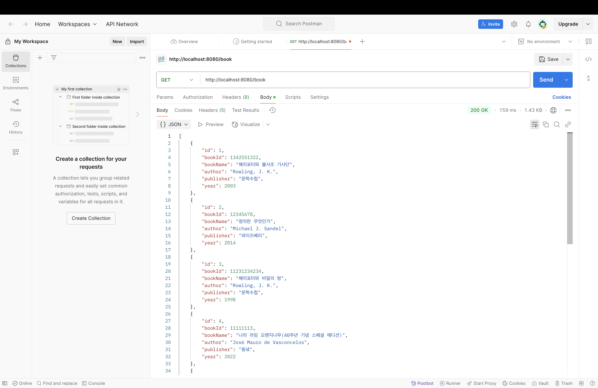
### 2. Read
- 저장된 책 전부 다 불러오기 -> `@Getmapping`으로 `http://localhost:8080/book`
- 원하는 책 id로 불러오기-> `@Getmapping`으로 `http://localhost:8080/book/id/{원하는 id}`
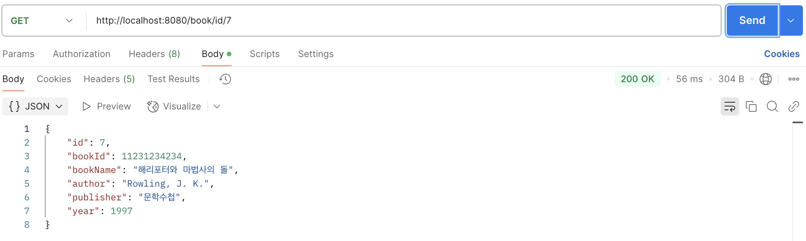
- 원하는 책 책이름으로 불러오기 -> `@Getmapping`으로 `http://localhost:8080/book/name/{원하는 책이름}`
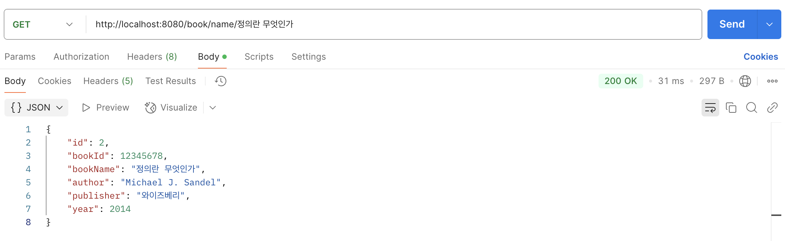
- 
### 3. Update
- 원하는 책 id로 수정하기-> `@Patchmapping`으로 `http://localhost:8080/book/id/{원하는 id}`
# Update 전
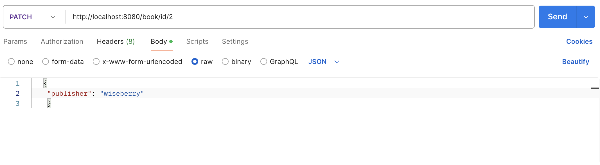
# Update 후

- 원하는 책 책이름으로 수정하기 -> `@Patchmapping`으로 `http://localhost:8080/book/name/{원하는 책이름}`
# Update 전
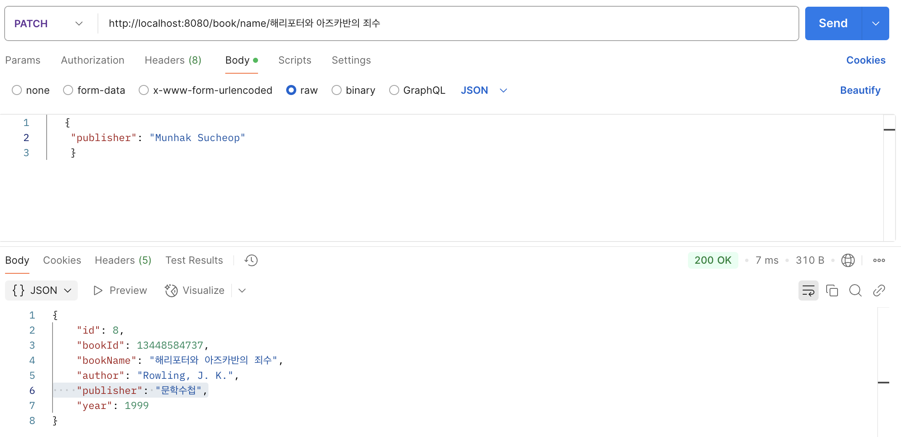
# Update 후
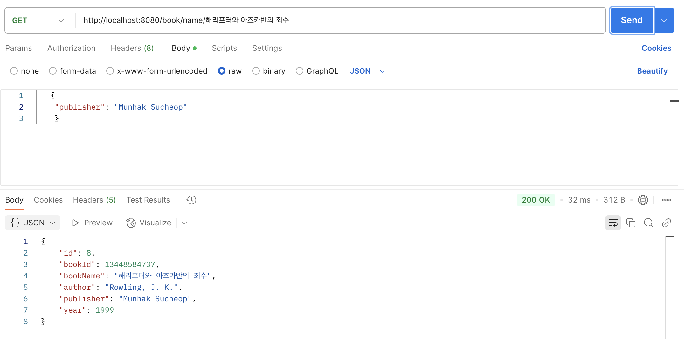
- 여기서 만약에 없는 id나 책이름을 입력하게 되면 exception 발생시킴
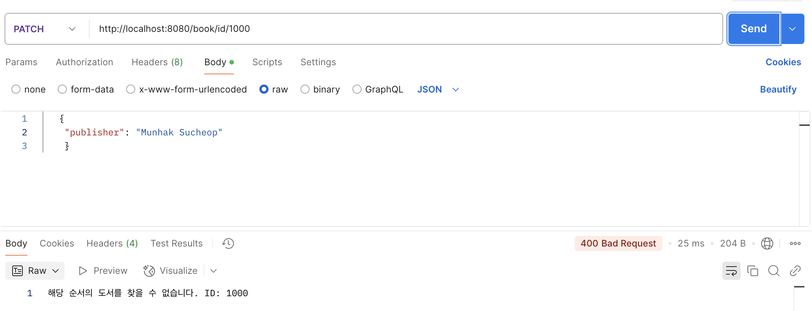
### 4. Delete
- 원하는 책 id로 삭제하기-> `@Deletemapping`으로 `http://localhost:8080/book/id/{원하는 id}`
- 원하는 책 책이름으로 삭제하기 -> `@Deletemapping`으로 `http://localhost:8080/book/name/{원하는 책이름}`
- 여기서도 만약에 없는 id나 책이름을 입력하게 되면 exception 발생시킴

### 5. 나만의 jpa 3가지

- 1. “해리포터” 시리즈 책 보여주기
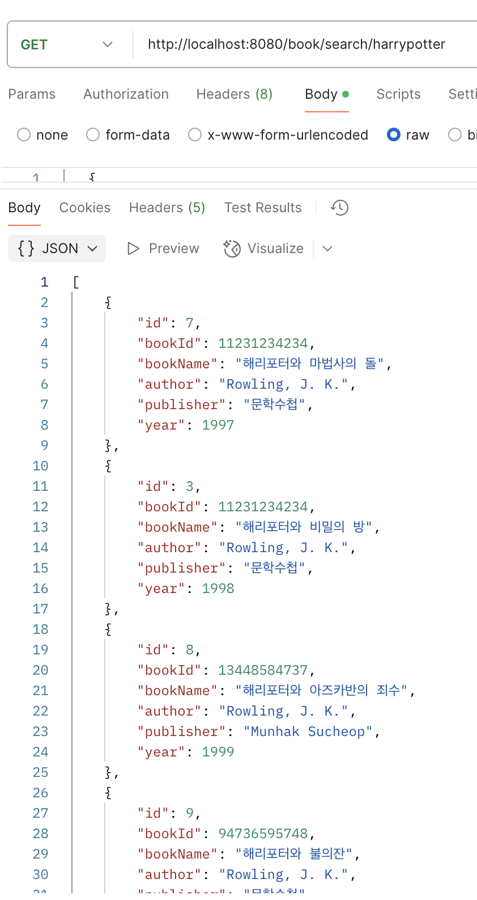
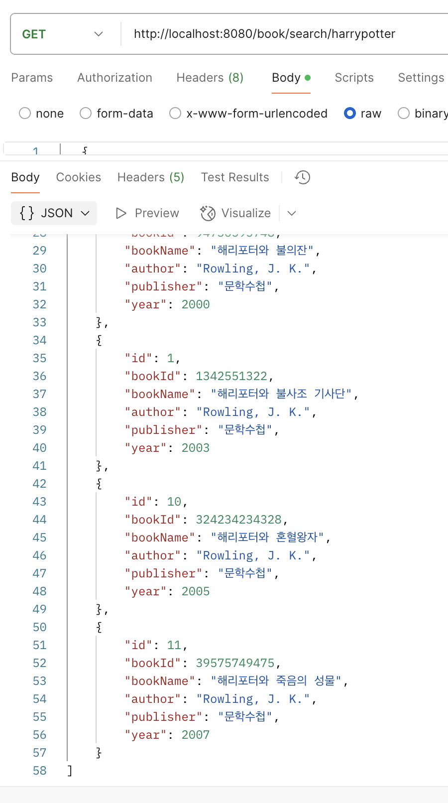
- 2. “해리포터” 아닌 책 보여주기
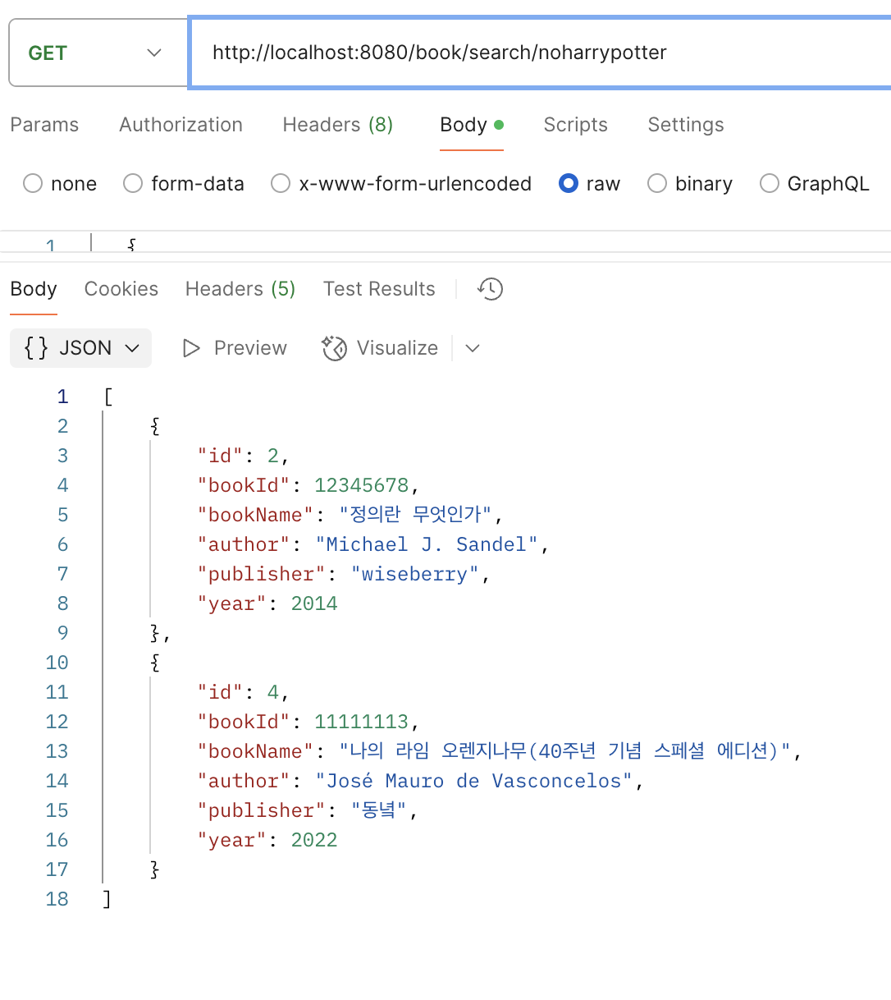
- 3. 2015년 이전에 나온 책
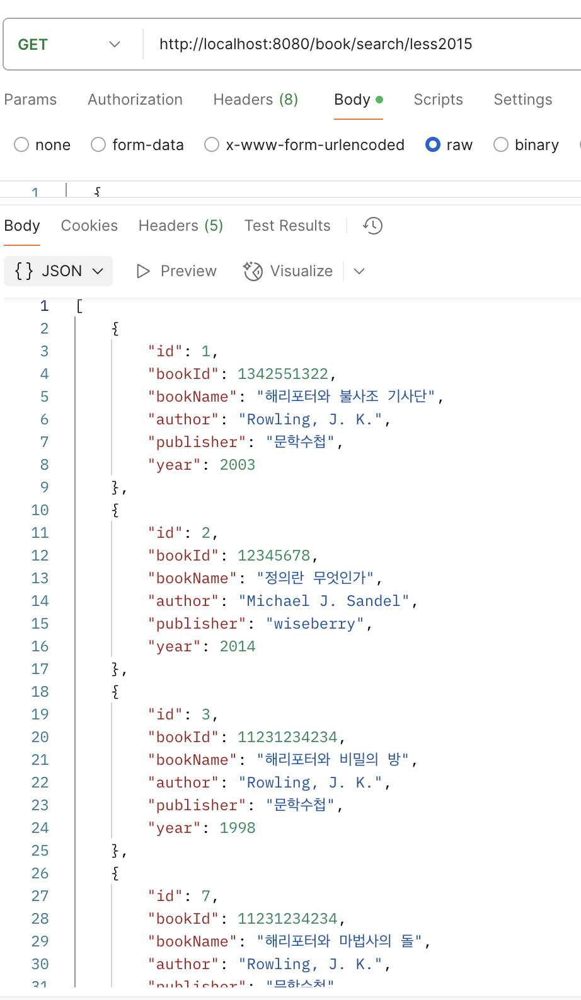