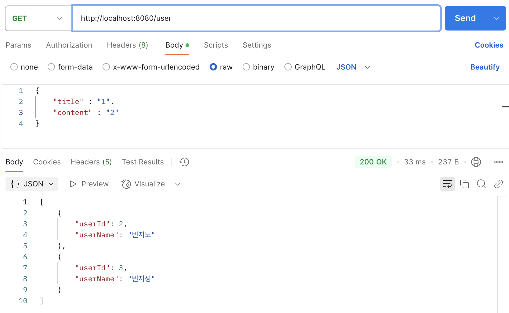
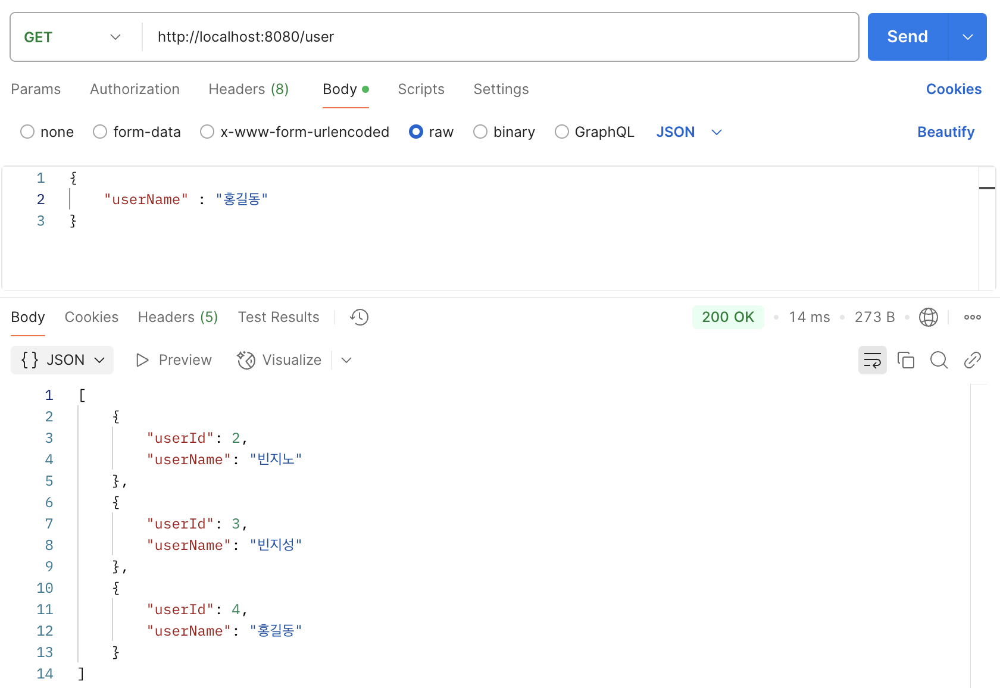
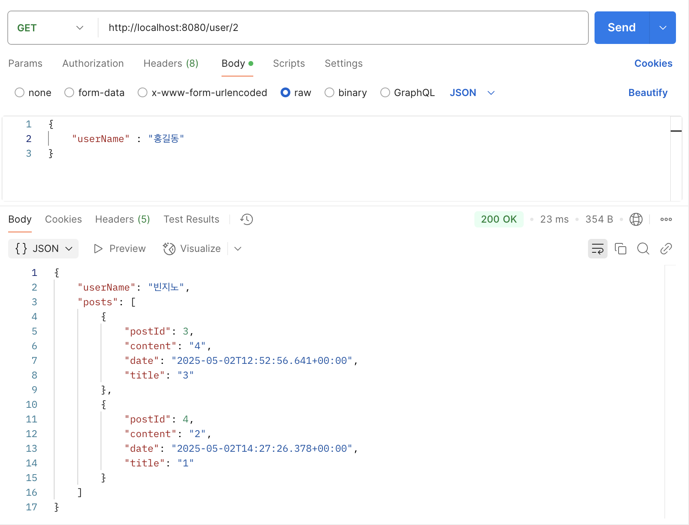
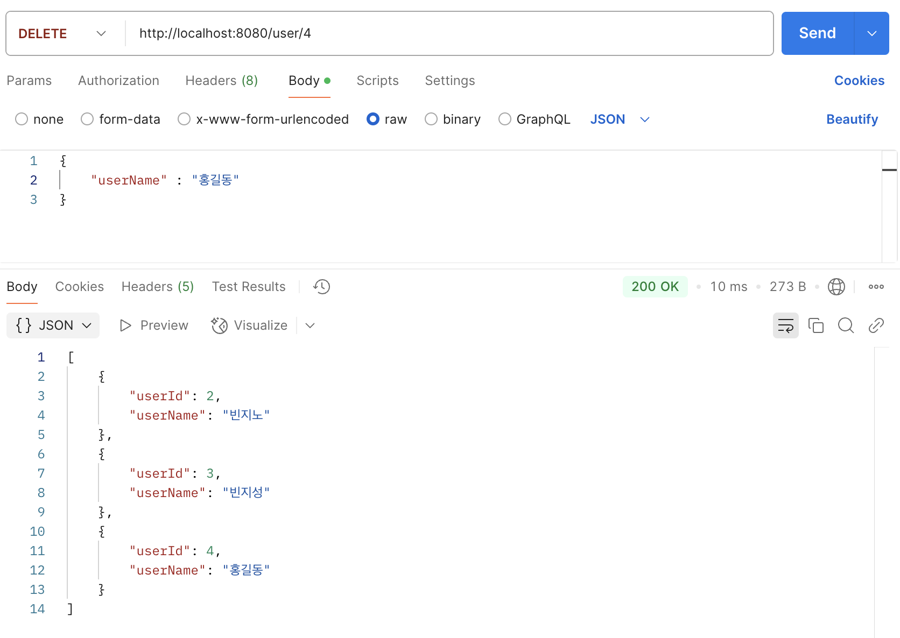
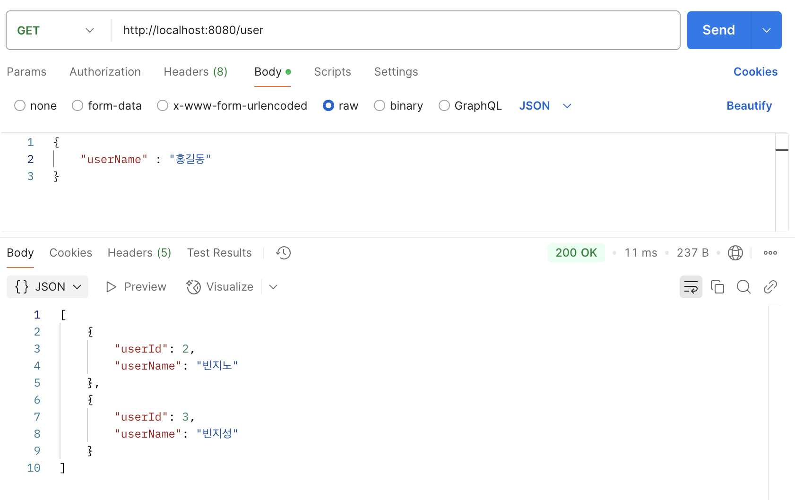
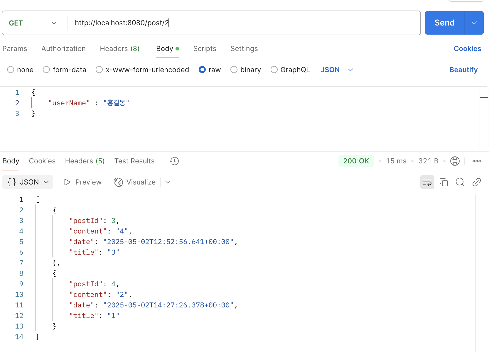
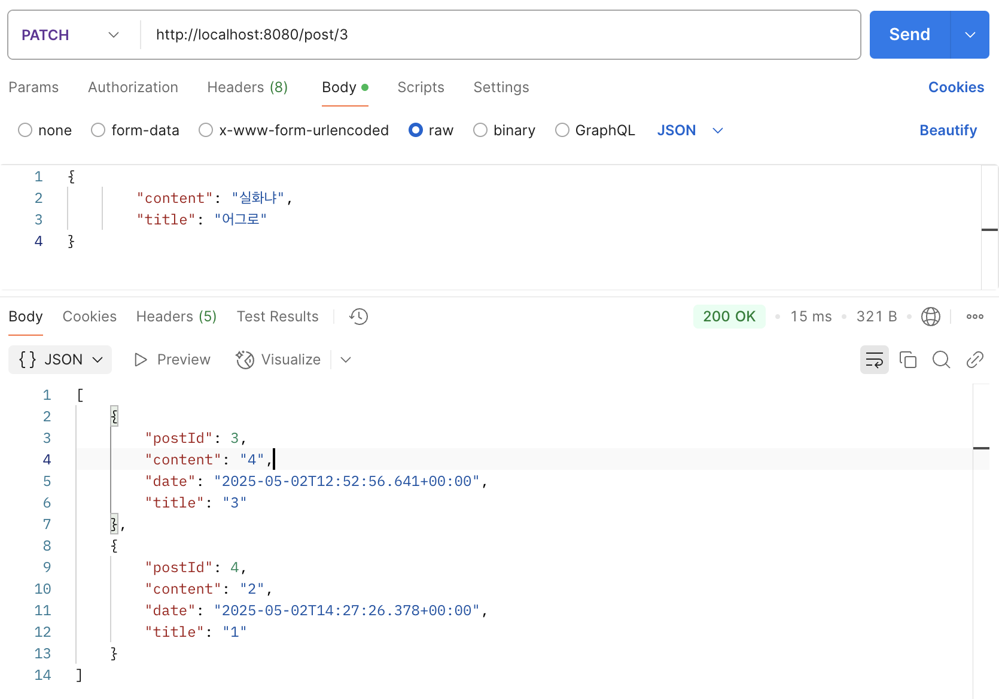
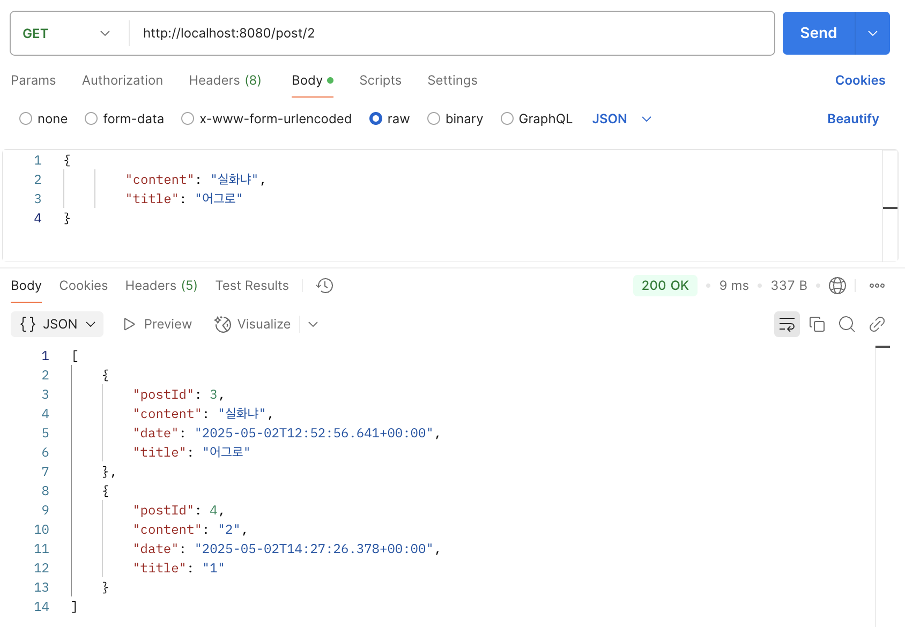
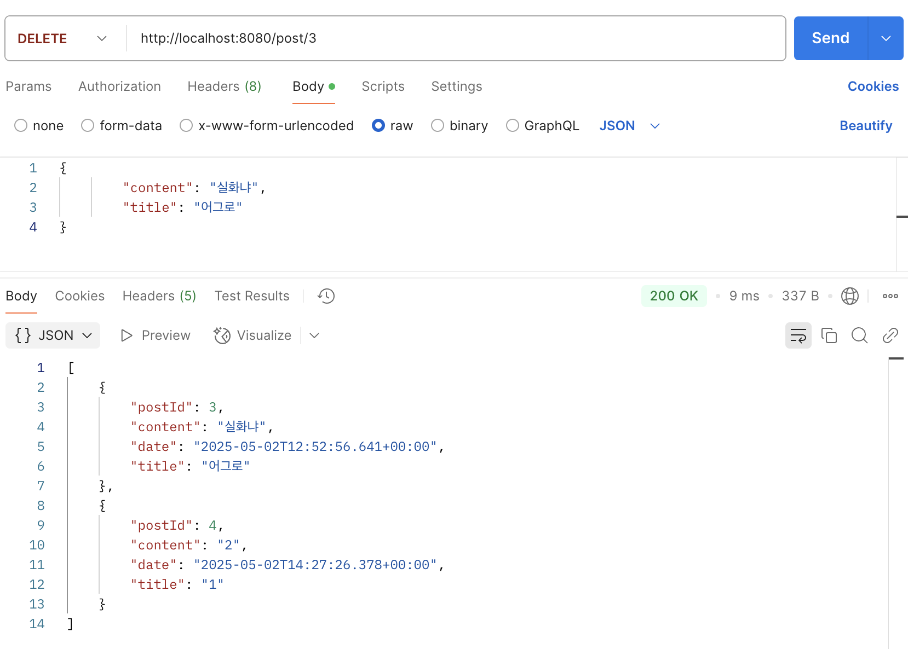
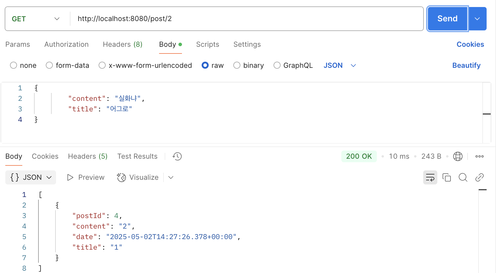

# 이번 과제는 블로그 만들기
- 작성자별 게시글 목록 조회 
- 새로운 게시글 작성 시 작성자 선정
- 게시글 수정 및 삭제

## 이번 과제 특별한 점
- 연관관계를 사용해서 다른 entity의 정보를 쓸 수 있음

# User 코드 설명
## 1. User Entity
```
   public class User {
   @Id
   @GeneratedValue(strategy = GenerationType.IDENTITY)
   private Long userId;

   @Column(nullable = false, unique = true, length  = 30)
   private String userName;

   @OneToMany(mappedBy = "user", cascade = CascadeType.ALL, orphanRemoval = true)
   private List<Post> posts;

}
```
- 한 유저가 여러개의 블로그의 글을 쓸 수 있기 때문에 @OneToMany를 사용함.
- cascade는 한 유저가 삭제되면 그와 관련된 모든 거를 삭제할 때 사용
- orphanRemoval는 한 글이 삭제됐을 때 그거와 관련된 것을 삭제

## 2. User Dto
- response랑 request 분리
- RequestUserDto
```
public class RequestUserDto {//request 중 읽는거,생성하는 거 두개 구분
    @Getter
    @NoArgsConstructor
    @AllArgsConstructor
    @Builder
    public static class UserReadRequest{//읽는 request
        private Long userId;
        private String userName;
        private List<Post> posts;

        public static UserReadRequest from(User u){
            return new UserReadRequest(u.getUserId(),u.getUserName(),u.getPosts());
        }
    }
    @Getter
    @JsonInclude(JsonInclude.Include.NON_NULL)
    @NoArgsConstructor
    @AllArgsConstructor
    public static class UserCreateRequest{//생성하는 reqeust
        private String userName;
    }

}
```
- request 두 종류 -> 생성,읽기
- from을 사용하는 이유 : 생성자를 직접 호출 하는 것보다 가독성이 좋고, 추가적인 로직을 더 넣을 수 있다고 함.
- ResponseUserDto
```
public class ResponseUserDto {

    @Getter
    @Builder
    @NoArgsConstructor
    @AllArgsConstructor
    public static class ReadUser{
        private String userName;
        private List<ResponsePostDto.PostingReadResponse> posts;

        public static ReadUser from(User user){
            return new ReadUser(user.getUserName(),
                    ResponsePostDto.PostingReadResponse.postingToDto(
                    user.getPosts()));
        }
    }

    @Getter
    @Builder
    @NoArgsConstructor
    @AllArgsConstructor
    public static class ReadAllUser{
        private Long userId;
        private String userName;

        public static ReadAllUser from(User user) {
            return new ReadAllUser(user.getUserId(), user.getUserName());
        }
    }
}
```
- ReadUser에서 ResponsePostDto 형태로 post의 정보를 가져옴(해당 username에 해당하는)
- ReadAllUser에서는 전체 user를 보여줌

## 3. User Controller
```
public class UserController{
    private final UserService userService;
    @GetMapping("")
    public List<ResponseUserDto.ReadAllUser> readAll() {
        return userService.readAll();
    }
    @GetMapping("/{userId}")
    public ResponseUserDto.ReadUser readUser(@PathVariable Long userId){
        return userService.readUser(userId);
    }
    @PostMapping("")
    public String createUser (@RequestBody RequestUserDto.UserCreateRequest req){
        userService.createUser(req);
        return("사용자 저장 성공!");
    }
    @DeleteMapping("/{Id}")
    public void deleteUser(@PathVariable Long Id){
        userService.deleteUser(Id);
    }
}
```
- readAll() : 전체 user를 보여줌
- readUser() : 해당 user의 글을 보여줌
- createUser() : user를 생성
- deleteUser() : user를 삭제

## 4. User Service
```
public class UserService {
    private final UserRepository userRepository;

    public List<ResponseUserDto.ReadAllUser> readAll() {
        List<User> users = userRepository.findAll();
        List<ResponseUserDto.ReadAllUser> p = users.stream().map(
                user -> ResponseUserDto.ReadAllUser.builder()
                        .userId(user.getUserId())
                        .userName(user.getUserName())
                        .build()).toList();
        return p;
    }

    public ResponseUserDto.ReadUser readUser(Long userId){

        Optional<User> u = userRepository.findById(userId);
        if(u.isPresent()){
            User user = u.get();
            ResponseUserDto.ReadUser ret = ResponseUserDto.ReadUser.from(user);
            return ret;
        }
        else{
            throw new IllegalArgumentException("User is not existed");
        }
    }
    public void createUser(RequestUserDto.UserCreateRequest req){
        User user = new User(null,req.getUserName(),new ArrayList<>());
        userRepository.save(user);
    }
    public void deleteUser(Long userId){
        User user = userRepository.findById(userId).orElseThrow(IllegalAccessError::new);
        userRepository.delete(user);
    }
}
```
- 예외처리를 throw로 해줌
- ```ResponseUserDto.ReadUser ret = ResponseUserDto.ReadUser.from(user);``` 이 부분이 from이 적용된 부분임
## 5. User Repository
```
public interface UserRepository extends JpaRepository<User,Long> {

}
```
- 그냥 JpaRepository를 extends 해주면 됨.

# Post 코드 설명
## 1. Post Entity
```
public class Post {
    @Id
    @GeneratedValue(strategy = GenerationType.IDENTITY)
    private Long postId;

    @Column(nullable = false, length = 30)
    private String title;

    @Column(nullable = false, length = 500)
    private String content;
    @CreationTimestamp
    private Timestamp date;

    @ManyToOne
    @JoinColumn(name = "user_id")
    private User user;

    public static Post from(String title,String content,Timestamp date,User user){
        return new Post(null, title,content,date,user);
    }
    public void updateContent(String content){
        this.content = content;
    }
    public void updateTitle(String title){
        this.title = title;
    }
}
```
- 여기서는 @ManyToOne을 사용

## 2. Post Dto
- response랑 request 분리
- RequestPostDto
```
public class RequestPostDto {
    @Getter
    @Setter
    @NoArgsConstructor
    @AllArgsConstructor
    @Builder

    public static class PostCreateRequest{
        private String title;
        private String content;
        private Timestamp date;
    }

}
```

- ResponsePostDto
```
public class ResponsePostDto {

    @Getter
    @Builder
    @AllArgsConstructor
    @NoArgsConstructor
    public static class PostingReadResponse{
        private Long postId;
        private String Title;
        private String content;
        private Timestamp date;

        public static List<PostingReadResponse> postingToDto(List<Post> posts){
            List<PostingReadResponse> prr = new ArrayList<>();
            for(Post post : posts){
                PostingReadResponse p=
                new PostingReadResponse(post.getPostId(),post.getTitle(),post.getContent(),post.getDate());
                prr.add(p);
            }
            return prr;
        }
    }
}
```
- ```for(Post post : posts)``` 이런 방법들을 통해서 dto list를 담을 수 있음

## 3. Post Controller
```
public class PostController {
    private final PostService postService;

    @PostMapping("/{userId}")
    public String CreatePost(@PathVariable Long userId,@RequestBody RequestPostDto.PostCreateRequest req){
        postService.createPost(userId,req);
        return("글 저장 성공!");
    }
    @GetMapping("/{userId}")
    public List<ResponsePostDto.PostingReadResponse> readByUserId(@PathVariable Long userId){
        return postService.findByUserId(userId);
    }
    @PatchMapping("/{postId}")
    public String update(@PathVariable Long postId, @RequestBody RequestPostDto.PostCreateRequest postDto){
        postService.update(postId,postDto);
        return "수정완료!";
    }
    @DeleteMapping("/{postId}")
    public String delete(@PathVariable Long postId){
        postService.delete(postId);
        return "삭제완료";
    }
}
```
- createPost : 블로그 글을 생성(user가 있어야 함-> 없으면 에러처리)
- delete : 블로그 글 삭제
- update : 블로그 글 수정
- reaedByUserId : 특정 user의 블로그 글만 볼 수 있음

## 4. Post Service
```
public class PostService {
    private final UserRepository userRepository;
    private final PostRepository postRepository;

    public void createPost(Long userId,RequestPostDto.PostCreateRequest req){
        Optional<User> u = userRepository.findById(userId);
        if(u.isPresent()){
            User user = u.get();
            Post post = Post.from(req.getTitle(),req.getContent(),req.getDate(),user);
            postRepository.save(post);
        }
    }
    public ResponsePostDto.PostingReadResponse readPost(Long postId) {
        Optional<Post> p = postRepository.findById(postId);
        if (p.isPresent()) {
            Post post = p.get();
            return new ResponsePostDto.PostingReadResponse(postId, post.getTitle(),post.getContent(), post.getDate());
        }
        else{
            throw new IllegalArgumentException("postId가 존재하지 않음");
        }
    }
    public List <ResponsePostDto.PostingReadResponse> findByUserId(Long userId){
        List<Post> posts = postRepository.findByUser_UserId(userId);
        List<ResponsePostDto.PostingReadResponse> postDtos = posts.stream().map(
                post -> ResponsePostDto.PostingReadResponse.builder()
                        .postId(post.getPostId())
                        .content(post.getContent())
                        .Title(post.getTitle())
                        .date(post.getDate())
                        .build()).toList();
        return postDtos;
    }
    @Transactional
    public void update(Long postId,RequestPostDto.PostCreateRequest postDto){
        Optional<Post> p = postRepository.findById(postId);
        if(p.isPresent()){
            Post post = p.get();
            post.updateTitle(postDto.getTitle());
            post.updateContent(postDto.getContent());
            postRepository.save(post);
        }
        else{
            throw new IllegalArgumentException("postId가 존재하지 않음");
        }
    }
    public void delete(Long postId){
        postRepository.deleteById(postId);
    }
    }
```
- 예외처리를 throw로 해줌
- 
## 5. Post Repository
```
public interface PostRepository extends JpaRepository<Post,Long> {
    List<Post> findByUser_UserId(Long userId);
}
```
- 그냥 JpaRepository를 해선 findByUser_UserId 선언만 해주면 됨

# 실행장면












