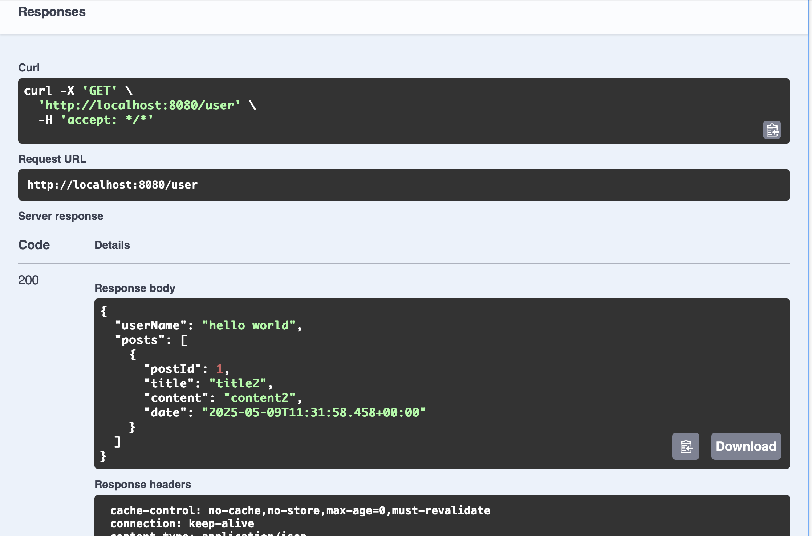
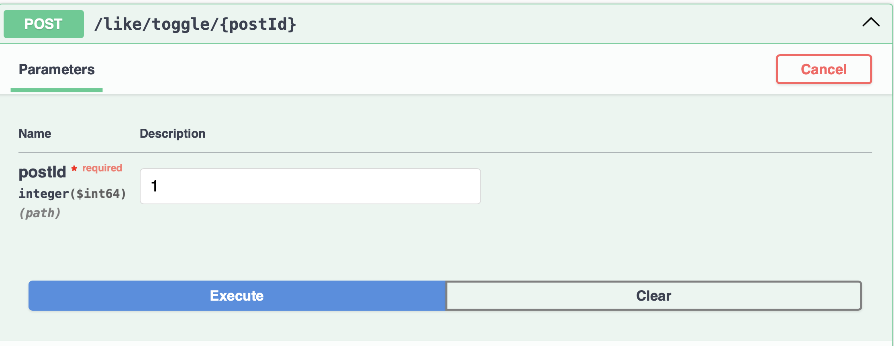
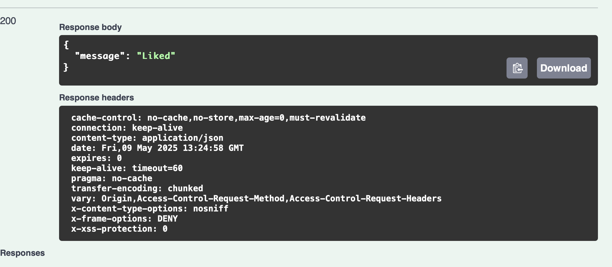
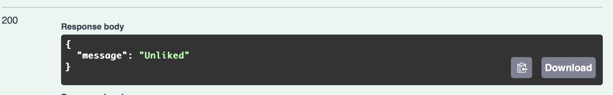

## Swagger
##### hw4할때 swagger 안됐어....ㅠㅠ
##### 안됐던 이유는 버전이 안 맞아서 그렇다고 한다~
##### build.gradle 파일에서 버전을 밑에 걸로 바꿔주니깐 실행이 됐으~

```java
plugins{
id 'java'
id 'org.springframework.boot' version '3.3.5'
id 'io.spring.dependency-management' version '1.1.6'
}
```

<p align="center"></p>

---
### swagger 필요한 부분들!!

#### 1. dependency 추가
`implementation 'org.springdoc:springdoc-openapi-starter-webmvc-ui:2.3.0'`

#### 2. SwaggerConfig 파일 만들기

#### 3. swagger 확인
http://localhost:8080/swagger-ui/index.html
- 프론트하고 작업할 때 더 편리하고 좋다고 해서 이제 postman으로 안해도 돼~

<p align="center"></p>

---

## 추가 기능 구현(like,login)
//현재 post되어 있는 거를 보여줌
<p></p>

지금 현재  로그인되어 있는거에서 userId를 빼와서 실행을 함.
그래서 swagger에서 추가하기 전에 로그인을 하고 나서 swagger에서 해당 id가 필요한 행동을 하면 됨
<p></p>
<p></p>

---
한 번 더 좋아요를 한 번 더 누르게 된다면 좋아요가 사라지는 것을 확인할 수 있음
<p></p>

---

### 로그인

로그인 창 이미지
<p></p>

---

로그인을 하면 구글에 설정되어 있는 이름으로 나타나는 것을 확인할 수 있다.
<p>